# Simbo's Packages

A monorepo for my packages.

<!-- TOC depthFrom:2 depthTo:3 -->

- [Packages](#packages)
- [Development](#development)
  - [Requirements](#requirements)
  - [Setup](#setup)
  - [Toolset](#toolset)
  - [Usage](#usage)
  - [Releases and Publishing](#releases-and-publishing)
- [Changelog](#changelog)
- [License](#license)

<!-- /TOC -->

---

## Packages

TBD

## Development

### Requirements

- a linux-based operating system
- node.js (v22) via [nvm](https://github.com/nvm-sh/nvm)
- [pnpm](https://pnpm.io/) (v10)

### Setup

```bash
git clone git@github.com:simbo/packages.git
cd simbos-packages
pnpm install
pnpm run build
```

### Toolset

- Repository Management
  - [pnpm](https://pnpm.io/)
  - [Turborepo](https://turbo.build/)
  - [Changesets](https://github.com/changesets/changesets#readme)
  - [Commitlint](https://commitlint.js.org/)

- Documentation
  - [TypeDoc](https://typedoc.org/)

- Testing and Quality Control
  - [Vitest](https://vitest.dev/)
  - [ESLint](https://eslint.org/)
  - [Prettier](https://prettier.io/)
  - [CSpell](https://cspell.org/)

### Usage

#### Building

```bash
# build all packages
pnpm run build

# build a package
pnpm run build --filter=<TURBO_SELECTOR>
```

#### Dependencies

```bash
# install dependencies for all workspaces
pnpm install

# add a dependency to a workspace
pnpm add --filter=<PNPM_SELECTOR> [-D] <DEPENDENCY>

# remove a dependency from a workspace
pnpm remove --filter=<PNPM_SELECTOR> <DEPENDENCY>

# interactively update the dependency catalogs for all workspaces
pnpm update --recursive --interactive --latest
```

#### Tests

```bash
# run all tests for all packages
pnpm run test
# or for a specific package
pnpm run --filter=<PNPM_SELECTOR> test

# run tests in watch mode
pnpm run [--filter=<PNPM_SELECTOR>] test:watch

# run tests in ui mode
pnpm run [--filter=<PNPM_SELECTOR>] test:ui
```

#### Checks

```bash
# run all possible checks, builds, and tests
pnpm run preflight

# run all checks for all packages
pnpm run check

# prettier
pnpm run [--filter=<PNPM_SELECTOR>] check:format
pnpm run [--filter=<PNPM_SELECTOR>] fix:format

# eslint
pnpm run [--filter=<PNPM_SELECTOR>] check:eslint
pnpm run [--filter=<PNPM_SELECTOR>] fix:eslint

# cspell
pnpm run [--filter=<PNPM_SELECTOR>] check:spelling

# types
pnpm run [--filter=<PNPM_SELECTOR>] check:types

# workspace boundaries
pnpm run [--filter=<PNPM_SELECTOR>] check:boundaries
```

#### Docs

```bash
# generate API docs for all packages using typedoc
pnpm run build:docs

# serve the documentation locally
pnpm run serve:docs
```

### Releases and Publishing

Adding changesets to the main branch will automatically create releases for the
affected packages and publish them to the registry.

```mermaid
flowchart LR

  subgraph ChecksWorkflow["<code>.github/workflows/checks.yml</code>"]
    PushToMain@{ shape: rounded, label: "📥 Pushed to Main" }
    Checks["Run all Checks and Tests"]
    ChecksPassed{"All Checks<br>Passed?"}
    Changesets{"Changesets<br>Present?"}
    ReleaseEventDispatch@{ shape: rounded, label: "🎉 Release Event" }

    direction TB
    PushToMain --> Checks
    Checks --> ChecksPassed
    ChecksPassed --"YES"--> Changesets
    Changesets --"YES"--> ReleaseEventDispatch
  end

  subgraph ReleaseWorkflow["<code>.github/workflows/release.yml</code>"]
    ReleaseEvent@{ shape: rounded, label: "🎉 Release Event" }
    IntegrateChangesets["Integrate Changesets"]
    IncrementVersions["Increment Versions"]
    CollectPackages["Collect affected Packages<br><small>(Direct and Transitive)</small>"]
    CommitAndPushChanges["Commit & Push Changes"]
    PushReleaseTags["🏷️ Push a Tag for each<br><code>&lt;PACKAGE&gt;/v&lt;VERSION&gt;</code>"]

    direction TB
    ReleaseEvent --> IntegrateChangesets
    IntegrateChangesets --> IncrementVersions
    IncrementVersions --> CollectPackages
    CollectPackages --> CommitAndPushChanges
    CommitAndPushChanges --> PushReleaseTags
  end

  subgraph PublishWorkflow["<code>.github/workflows/publish.yml</code>"]
    TagEvent@{ shape: rounded, label: "🏷️ Tag Pushed<br><code>&lt;PACKAGE&gt;/v&lt;VERSION&gt;</code>" }
    BuildPackage["Build Package"]
    CreateTarball["Create Tarball"]
    ExtractChangelogEntry["Extract Changelog Entry"]
    CreateRelease["🎁 Create GitHub Release"]
    IsPrivate{"Package is<br>Private?"}
    PublishToNpm[🚀 Publish to npm Registry]

    direction TB
    TagEvent --> BuildPackage
    BuildPackage --> CreateTarball
    CreateTarball --> ExtractChangelogEntry
    ExtractChangelogEntry --> CreateRelease
    CreateRelease --> IsPrivate
    IsPrivate --"NO"--> PublishToNpm
  end

  ChecksWorkflow Link1@=== ReleaseWorkflow
  ReleaseWorkflow Link2@=== PublishWorkflow

  classDef animateLink stroke: #888888,stroke-dasharray:9,5,stroke-dashoffset:900, animation: dash 25s linear infinite;
  class Link1,Link2 animateLink

  classDef workflow stroke:#888888,fill:transparent;
  class ChecksWorkflow,ReleaseWorkflow,PublishWorkflow workflow

  classDef event stroke:#B54BC8,stroke-width:2px,fill:transparent;
  class PushToMain,TagEvent,ReleaseEventDispatch,ReleaseEvent event

  classDef step stroke:#6366F1,stroke-width:2px,fill:transparent;
  class Checks,IntegrateChangesets,IncrementVersions,CollectPackages,CommitAndPushChanges,PushReleaseTags,BuildPackage,CreateTarball,ExtractChangelogEntry,CreateRelease,PublishToNpm step

  classDef gate stroke:#E67E22,stroke-width:2px,fill:transparent
  class IsPrivate,ChecksPassed,Changesets gate
```

<details><summary>🚀 <em>Continuous Integration Flow</em></summary>



</details>

## Changelog

👉 [`./packages/changelog/CHANGELOG.md`](./packages/changelog/CHANGELOG.md)

## License

[MIT © Simon Lepel](http://simbo.mit-license.org/)
